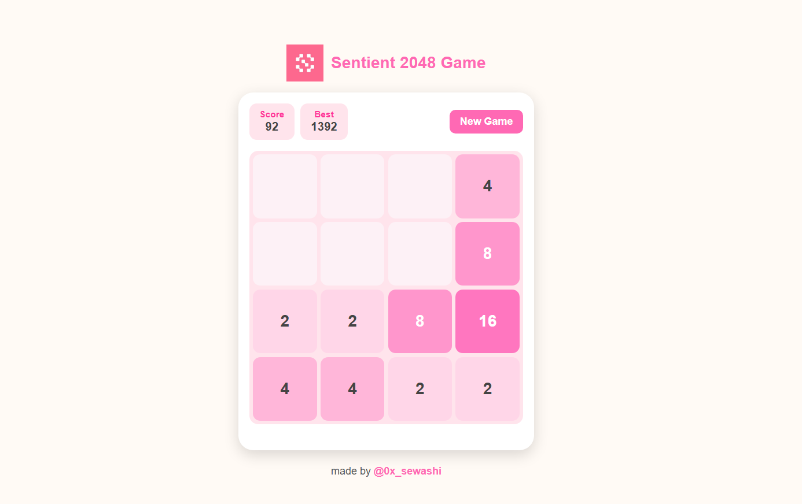

# 🎯 Sentient 2048 Game

A modern, minimal, and mobile-friendly version of the **2048 puzzle game**, made with pure **HTML, CSS, and JavaScript** 

---

## 🧠 About the Game
Sentient 2048 is a fun and elegant take on the classic 2048 game.  
You combine tiles with the same numbers to reach the **2048 tile** or keep going for a higher score!

- Smooth swipe + keyboard controls  
- Dynamic score tracking with local storage  
- Game over popup  
- Clean responsive UI with soft gradients  

---

## 🕹️ Controls

| Action | Input |
|--------|--------|
| Move Up | ⬆️ Arrow Up / Swipe Up |
| Move Down | ⬇️ Arrow Down / Swipe Down |
| Move Left | ⬅️ Arrow Left / Swipe Left |
| Move Right | ➡️ Arrow Right / Swipe Right |
| New Game | Click “New Game” button |

## 🧩 Features

🌀 Smooth gameplay with animations

🧮 Local storage for best score

🖥️ Works perfectly on desktop and mobile

💥 Game over popup

🎨 Custom color palette

## 🧑‍💻 Developer

Made by @0x_sewashi

Built with ❤️ using HTML, CSS, and JavaScript.
